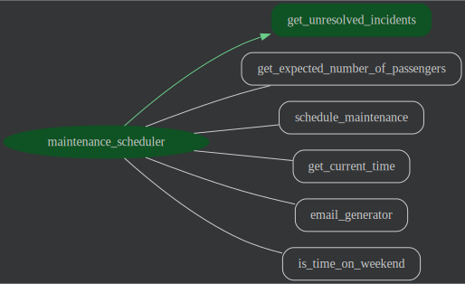

# Bus Stop Maintenance Scheduling Agent

## Overview

This project implements an AI-powered bus stop maintenance scheduling agent (the agent). 

## Agent Details

The agent's main task is to analyze open bus stop incidents, prioritize repairs, and dispatch maintenance crews. 
This is achieved through the following key features:
* **Rule-based Scheduling:** Bus stop selection can be prioritized using rules defined in natural language.
* **Flexible Operations:** The agent can operate in both interactive and autonomous modes.
* **Advanced AI Integration:** The agent combines BigQuery's time-series forecasting with the reasoning capabilities of the latest Gemini models.
* **Multi-Agent Collaboration:** Multiple agents are utilized to accomplish specific tasks.

### Agent Architecture



#### Tools

The agent has access to the following tools:
* **Get Unresolved Incidents:** Retrieves the list of incidents and bus stop data from BigQuery
* **Get Expected Number of Passengers:** Gets the time-series forecast of the bus ridership using BigQuery's TimesFM forecasting model
* **Get Current Time:** Returns the current time which will be used to schedule maintenance in the future
* **Is Time on Weekend:** Used by agent to schedule non-urgent maintenance during business hours.
* **Generate Email:** Uses a separate agent to generate well formatted email which will be sent to the maintenance crew
* **Schedule Maintenance:** Simulates the scheduling by updating the status of an incident with the "SCHEDULED" status and the notification details

## Setup and Installations

### Prerequisites

- Python 3.11+
- Poetry (for dependency management)
- Google ADK SDK (installed via Poetry)
- Google Cloud Project (for Vertex AI Gemini integration)

### Installation
1.  **Prerequisites:**
    Run the Terraform scripts described in the [Getting Started with the Terraform](https://github.com/GoogleCloudPlatform/data-to-ai/tree/maintenance-scheduler-agent?tab=readme-ov-file#getting-started-with-the-terraform) section of the top level README file.

    Make sure to run the scripts that process the test data, e.g. run at least one `upload-batch.sh`
    invocation and make sure that both `process_images` and `update_incidents` stored procedures
    have been run. At the end of this process you will have several records in the `incidents` table
    with the status "OPEN". This is the starting point for the agent to start scheduling
    maintenance.

1.  Switch to the agent's directory

    ```bash
    cd agents/maintenance-scheduler
    ```

    For the rest of this tutorial **ensure you remain in the `agents/maintenance-scheduler` directory**.

2.  Install dependencies using Poetry:

- if you have not installed poetry before then run `pip3 install poetry` first. Then you can create your virtual environment and install all dependencies using:

  ```bash
  poetry install
  ```

  To activate the virtual environment run:

  ```bash
  poetry env activate
  ```

3.  Set up environment variables that will be used by the local version of ADK
    - Set the `GOOGLE_GENAI_USE_VERTEXAI`, `GOOGLE_CLOUD_PROJECT`, and `GOOGLE_CLOUD_LOCATION` environment variables. You can set them in your `.env` file (modify and rename .env_sample file to .env) or directly in your shell.

    ```bash
    export GOOGLE_CLOUD_PROJECT=YOUR_PROJECT_ID_HERE
    export GOOGLE_GENAI_USE_VERTEXAI=1
    export GOOGLE_CLOUD_LOCATION=us-central1
    ```

## Running the Agent

You can run the agent using the ADK command in your terminal.

1.  Run agent in CLI:

    ```bash
    adk run maintenance_scheduler
    ```

2.  Run agent with ADK Web UI:
    ```bash
    adk web
    ```
    Select the maintenance_scheduler from the dropdown

[//]: # (### Example Interaction - TODO)

[//]: # ()
[//]: # (## Evaluating the Agent)

[//]: # ()
[//]: # (Evaluation tests assess the overall performance and capabilities of the agent in a holistic manner.)

[//]: # ()
[//]: # (**Steps:**)

[//]: # ()
[//]: # (1.  **Run Evaluation Tests:**)

[//]: # (    [//]: # &#40;TODO: implement&#41;)

[//]: # (    ```bash)

[//]: # (    pytest eval)

[//]: # (    ```)

[//]: # ()
[//]: # (    - This command executes all test files within the `eval` directory.)

[//]: # ()
[//]: # (## Unit Tests)

[//]: # ()
[//]: # (Unit tests focus on testing individual units or components of the code in isolation.)

[//]: # ()
[//]: # (**Steps:**)

[//]: # ()
[//]: # (1.  **Run Unit Tests:**)

[//]: # ()
[//]: # ([//]: # &#40;TODO: implement&#41;)
[//]: # (    ```bash)

[//]: # (    pytest tests/unit)

[//]: # (    ```)

[//]: # ()
[//]: # (    - This command executes all test files within the `tests/unit` directory.)

## Configuration

You can find further configuration parameters
in [maintenance_scheduler/config.py](maintenance_scheduler/config.py). This includes parameters such
as agent name, app name and LLM model used by the agent. Most of the parameters can be configured by
overriding the default values in the `.env` file.

## Deployment to Google Agent Engine

In order to inherit all dependencies of your agent you can build the wheel file of the agent and run the deployment.

1. **Build Customer Service Agent WHL file**

    ```bash
    poetry build --format=wheel --output=deployment
    ```

2. **Deploy the agent to Agent Engine**
    It is important to run deploy.py from withing deployment folder so paths are correct

    ```bash
    cd deployment
    python deploy.py
    ```
   
3. **Capture the deployed agent's resource name
    If the deployment successful, the script will print a line similar to this:
    ```shell
    INFO:root:Agent deployed successfully under resource name: projects/<project_number>/locations/us-central1/reasoningEngines/<numeric_id>
    ```
    Capture the resource name and update `GOOGLE_AGENT_RESOURCE_NAME` variable in the `.env` file.

3. **Grant the service account running the engine required permissions**
    When the agent is deployed to the Agent Engine it is run in the context of a 
    particular service account. Please see [Vertex AI Documentation](https://cloud.google.com/vertex-ai/generative-ai/docs/agent-engine/set-up#service-agent) for details.
    
    The agent uses tools which need access to the BigQuery data and need to be able to run queries.
    The Terraform script [agent-engine.tf](../../infrastructure/terraform/agent-engine.tf) added all the necessary permissions.
    If you need to add additional permissions you can use the script below as an example to manually add them:

    ```bash
    gcloud beta services identity create --service=aiplatform.googleapis.com --project=${GOOGLE_CLOUD_PROJECT}
    GOOGLE_CLOUD_PROJECT_NUMBER=$(gcloud projects describe ${GOOGLE_CLOUD_PROJECT} --format="value(projectNumber)")
    AGENT_ENGINE_SA="service-${GOOGLE_CLOUD_PROJECT_NUMBER}@gcp-sa-aiplatform-re.iam.gserviceaccount.com"
    bq add-iam-policy-binding --member="serviceAccount:${AGENT_ENGINE_SA}" --role='roles/bigquery.dataEditor' "${GOOGLE_CLOUD_PROJECT}:bus_sto
    bq add-iam-policy-binding --member="serviceAccount:${AGENT_ENGINE_SA}" --role='roles/bigquery.dataViewer' "${GOOGLE_CLOUD_PROJECT}:bus_sto
    bq add-iam-policy-binding --member="serviceAccount:${AGENT_ENGINE_SA}" --role='roles/bigquery.dataViewer' "${GOOGLE_CLOUD_PROJECT}:bus_sto
    p_image_processing.bus_stops"
    ```

### Testing the Agent Engine deployment

1. **Run the test script**
    At the agents/maintenance-scheduler directory run:
    ```bash
    python test_deployed_agent.py
    ```
    
    You should see output similar to this:
    ```text
    {'content': {'parts': [{'thought': True,
                        'text': "Alright, here's what's running through my "
                                "mind: The user's asking about bus stop "
                                'maintenance. Before I give them an answer, I '
                                'need to check the system for any outstanding '
                                "issues. My first step is clear: I'll leverage "
                                "the `get_unresolved_incidents` tool. That'll "
                                'pull up a list of any open bus stop '
                                'maintenance requests.\n'
                                '\n'
                                "Once I get the data back, I'll interpret the "
                                'results. If the list is empty – fantastic! I '
                                'can tell the user straight away that '
                                "everything's in good shape, no immediate "
                                'action needed. But if there *are* open '
                                "incidents, I'll need to be more specific. "
                                "I'll let the user know maintenance is "
                                'required and perhaps even provide a quick '
                                "summary of the types of issues we're dealing "
                                'with.\n'
                     ...
   ```
## Deployment to Agentspace

Once the Agent Engine deployment is successful, the agent can be enabled on an Agentspace app.
Agentspace will be the UI of the agent.

### Create a new Agentspace instance

Once the instance is created, capture the so-called "app id" of that instance and
update the `AGENTSPACE_APP_ID` variable in the `.env` file.

### Deploy the agent into the Agentspace
Run the following script:

```shell
./register-with-agentspace.sh
```

### Use the agent
Navigate to the Agentspace app and click on the Bus Stop Maintenance Scheduler link
under the Agents menu.

Use the agent the way you used it when testing the agent locally.

